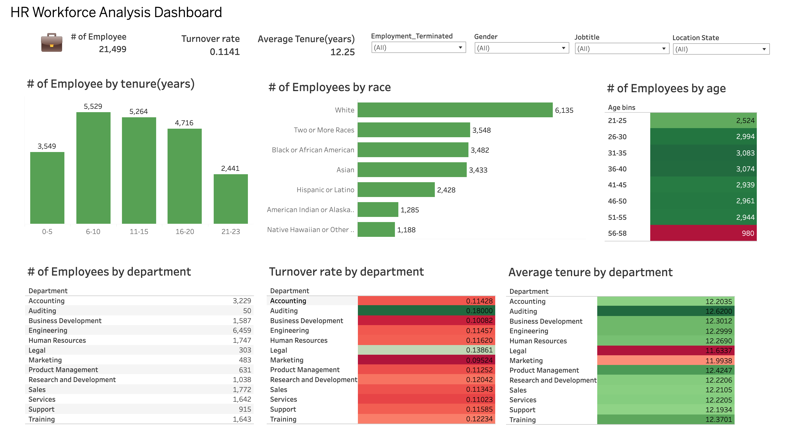

# HR-Workforce-Analysis
**Introduction**  

This report provides a comprehensive analysis of the workforce data to gain insights into various human resources metrics.  
The analysis covers aspects such as turnover rates, tenure, age distribution, and diversity within the workforce.

The dataset includes fields  like    
 
Id: Unique identifier for each employee  
first_name: Employee's first name  
last_name: Employee's last name  
birthdate: Employee's birth date  
gender: Employee's gender  
race: Employee's race  
department: Department where the employee works  
jobtitle: Employee's job title  
location: Employee's work location  
hire_date: Date the employee was hired  
term_date: Date the employee terminated employment (if applicable)  
location_city: City of the employee's work location   
location_state: State of the employee's work location    

## Data Preparation  
**Data Cleaning and Transformation**    
Date Format Standardization:  
The birthdate column had inconsistent formats (MM-DD-YY and MM/DD/YYYY). We standardized all dates to the YYYY-MM-DD format.  

Handling Missing Data:  
We identified and handled missing values in the dataset, particularly in the term_date column. Employees with a missing term_date are considered currently employed.  

Calculating Tenure:  
We calculated the tenure of employees in years. For employees without a term_date, we used the current date.  

Removing Invalid Birthdates:  
We removed rows with birthdate greater than today's date.  

Creating Age Bins:  
We categorized employees age into age bins for analysis.  

## Analysis  

1. **Demographic Distribution**
   Gender distribution
   The gender distribution of employees is as follow :  
   Male              50.8%  
   Female            46.48%
   Non-Conforming      2.7%
   
   Race Distribution
   The employees comes from 7 different ethnic backgrounds which indicates a diverse workforce ,
   the distribution is as follow :  
 
   White                                        28.5%
   Two or More Races                            16.5%
   Black or African American                    16.2%
   Asian                                        15.97%
   Hispanic or Latino                           11.3%
   American Indian or Alaska Native              5.98%
   Native Hawaiian or Other Pacific Islander     5.5%  

   Age Distribution

3. **Deparmental Analysis**
   There are 13 departments in the company , the engineering has the highest number of workforce while the auditing department has the least number of workforce ,
   30% of employees work in the engineeering department while 0.23% works in auditiing department.
   The distribution is as follow:

   Engineering                 30.04%  
   Accounting                  15.02%  
   Sales                        8.24%  
   Human Resources              8.13%  
   Training                     7.64%  
   Services                     7.64%  
   Business Development         7.38%  
   Research and Development     4.83%  
   Support                      4.26%  
   Product Management           2.94%  
   Marketing                    2.25%  
   Legal                        1.41%  
   Auditing                     0.23%

4. **Geographical Analysis**  
  There are two differeenct categories of employees ,those that work remotely and those that work at the headquarters ,a large percentage of employers 75.3% work from the headquarters which is in cleveland  while 24.7% work  remotely. For those that work remotely majority of them work from chicago 6.45% ,employees work from 77 different cities apart from the   headquarters.
   
5. **Tenure and turnover Analysis**
   The average tenure of employees  is 12.23 years ,across all departments ,the legal department has the least  average tenure of 11.63 years  while the auditing department has an average tenure of 12.62 years .
   Turnover Rate 
We calculated the turnover rate by department,race and location to understand employee attrition. The Native Hawaiian or Other Pacific Islander  employees has the highest turnover rate of 0.12 while the Hispanic or Latino has the lowest 0.106 .The auditing department has the highest turn over rate of 0.18 while the marketing department hs the least 0.095.  
Employees that work from headquarters have a turnover rate of approximately 0.12 and for remote workers 0.11.

6. **Visualization in Tableau**  
To visualize the data, we used Tableau to create an interactive dashboard.
Bar graphs showing the distribution of employee in age and race ,Heatmaps highlighting turnover rates across department.  

This is the link to the  interactive [dashboard](https://public.tableau.com/views/HR_17209131214260/Dashboard1?:language=en-GB&:sid=&:redirect=auth&:display_count=n&:origin=viz_share_link)

## Recommendations 

1. **Enhance Diversity and Inclusion Programs**

Gender Diversity: The company has a relatively balanced gender distribution, but efforts could be made to further support and retain non-conforming employees,
who currently make up only 2.7% of the workforce.  

Ethnic Diversity: With employees from seven different ethnic backgrounds, the company already has a diverse workforce.  
Continue to promote and implement diversity and inclusion programs to ensure all employees feel valued and included.  

2. **Focus on Employee Retention in High Turnover Departments**  

Auditing Department: This department has the highest turnover rate at 0.18. Conduct exit interviews and surveys to understand the reasons behind the high attrition and address these issues promptly.     

Marketing Department: Despite having the lowest turnover rate at 0.095, ensure that the policies and practices keeping this rate low are maintained and, if possible, applied to other departments.  

3. **Improve Remote Work Experience**  

With 24.7% of employees working remotely and a turnover rate of 0.11 for remote workers, it's important to enhance the remote work experience.  
Implement robust communication channels, offer remote work training, and ensure remote employees feel integrated into the company culture.  

4. **Promote a Healthy Work-Life Balance**

Ensure that all employees, whether remote or at headquarters, have access to wellness programs,flexible working hours, and resources to maintain a healthy work-life balance.   This can help in reducing burnout and improving overall job satisfaction.  

5. **Strengthen Employee Development and Career Growth**

Engineering Department: With 30.04% of the workforce in this department, focus on providing continuous learning opportunities,  
career advancement paths, and skill development programs to retain top talent.  

Across All Departments: Implement mentorship programs, regular performance reviews, and professional development opportunities to foster employee growth and satisfaction.

By addressing these areas, the company can improve employee satisfaction, reduce turnover rates, and enhance overall productivity.  
Implementing these recommendations will help create a more inclusive, supportive, and thriving workplace environment.

   

